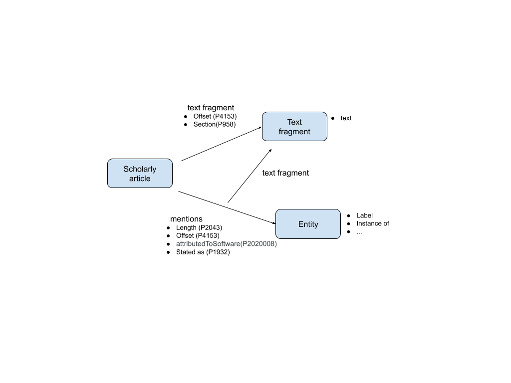

# CKG Covid-19 

We are building easy to use knowledge graphs (KG) about the scientific articles in the CORD-19 corpus published by the Allen Institute for AI. We integrate the outputs of several state of the art machine reading systems and several bio-informatics databases with Wikidata. To make the KG easy to use, we extracted from Wikidata the subset of items related to the scientifc articles in the CORD-19 corpus. The subset includes the scientific articles in the CORD-19 corpus, plus their citations and the genes, proteins, drugs, diseases, etc. related to them. We map the outputs of the machine reading systems to the Wikidata identifiers, and build an integrated dataset. Our goal is to build the smallest KG that contains useful information in a way that is easy for application developers to consume.

To make the KG easy to use, our primary dataset is published as an edge-list in TSV format. This dataset can be directly imported into Pandas, relational databases, graph software, etc. In addition, we offer the dataset in a public SPARQL endpoint using the Wikidata SPARQL platform, as an RDF dump and as a file that directly imports into Neo4J.

Github and files download: [https://github.com/usc-isi-i2/CKG-COVID-19](https://github.com/usc-isi-i2/CKG-COVID-19)

## Covid-19 Knowledge Graph
<a name="covid_kg_diagram" />

## New Properties in the Covid KG

We have added new properties as per the above diagram:

- entities mentioned in the scientific articles in CORD-19 corpus
- text fragments where entities are extracted from in the article
- a property `text` to store the text of a text fragment.

The following properties are added ,

| property | label                       | descriptions                                                          |
|----------|-----------------------------|-----------------------------------------------------------------------|
| P2020001 | "Text Fragment"@en          | text fragment of a scholarly article                                  |
| P2020002 | "mentions gene"@en          | gene mentioned in an article or text fragment                         |
| P2020003 | "mentions disease"@en       | disease mentioned in an article or text fragment                      |
| P2020004 | "mentions chemical"@en      | chemical mentioned in an article or text fragment                     |
| P2020005 | "mentions genus"@en         | genus mentioned in an article or text fragment                        |
| P2020006 | "mentions species"@en       | species mentioned in an article or text fragment                      |
| P2020007 | "mentions strain"@en        | strain mentioned in an article or text fragment                       |
| P2020008 | "attributed to software"@en | software used to extract information from an article or text fragment |
| P2020009 | "mentions mutation"@en      | mutation mentioned in an article or text fragment                     |
| P2020010 | "mentions cellline"@en      | cellline mentioned in an article or text fragment                     |
| P2020011 | "mentions domainmotif"@en   | domain motif mentioned in an article or text fragment                 |
| P2020012 | "text"@en                   | text in a text fragment                                               |

## Covid-19 Dataset

The data files are available to download from the folder `datasets/version_**`, current version is `01`.

All the files in this dataset have the following columns in common:

* `id` - a unique identifier for the rows in the file
* `node1` - subject of the item in a row
* `property` - the property describing the subject
* `node2` - the value or object of the property

We describe the contents and format of the files in the dataset in the following sections.

- [Scientific Articles in Wikidata](scientific_articles_in_wikidata.md)
- [Scientific Articles not in Wikidata](scientific_articles_not_in_wikidata.md)
- [Entities in Wikidata](entities_in_wikidata.md)
- [Entities not in Wikidata](entities_not_in_wikidata.md)
- [Qualifiers for Scientific Articles and Entities in wikidata](qualifiers_wikidata_kgtk.md)
- [Blender Mentions](covid_kgtk_blender_mentions_with_labels.md)
- [Blender Mentions Qualifiers](covid_kgtk_blender_mentions_qualifiers.md)

