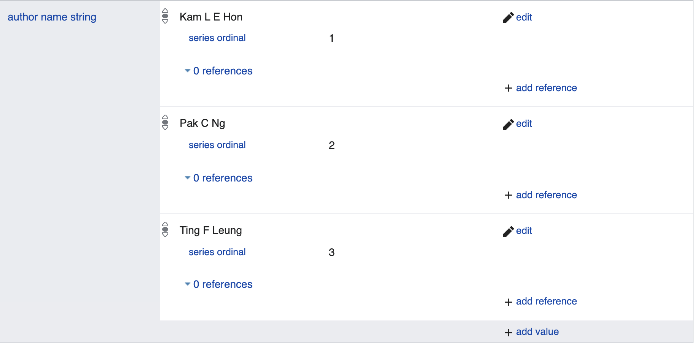

## Qualifiers: Scientific Articles and Entities in Wikidata

The file, `qualifiers_wikidata_kgtk.tsv.gz`, contains the qualifiers on the property edges
for scientic articles and entities present in Wikidata.

For example, the following image shows the qualifiers `series ordinal` on the property `author name string` for the
scientific article `Q21093209`

 

Sample ,

| id                 | node1      | property | node2                    |
|--------------------|------------|----------|--------------------------|
| Q45-P38-1-P580-1   | Q45-P38-1  | P580     | ^1999-01-01T00:00:00Z/11 |
| Q45-P38-2-P582-1   | Q45-P38-2  | P582     | ^2002-02-28T00:00:00Z/11 |
| Q45-P37-2-P580-1   | Q45-P37-2  | P580     | ^1999-01-29T00:00:00Z/11 |
| Q45-P35-1-P580-1   | Q45-P35-1  | P580     | ^2006-03-09T00:00:00Z/11 |
| Q45-P35-1-P582-1   | Q45-P35-1  | P582     | ^2016-03-09T00:00:00Z/11 |
| Q45-P35-2-P580-1   | Q45-P35-2  | P580     | ^2016-03-09T00:00:00Z/11 |
| Q45-P35-3-P580-1   | Q45-P35-3  | P580     | ^1996-03-09T00:00:00Z/11 |
| Q45-P35-3-P582-1   | Q45-P35-3  | P582     | ^2006-03-09T00:00:00Z/11 |
| Q45-P35-4-P580-1   | Q45-P35-4  | P580     | ^1986-03-09T00:00:00Z/11 |
| Q45-P35-4-P582-1   | Q45-P35-4  | P582     | ^1996-03-09T00:00:00Z/11 |
| Q45-P47-1-P805-1   | Q45-P47-1  | P805     | Q2699571                 |
| Q45-P31-1-P580-1   | Q45-P31-1  | P580     | ^1415-00-00T00:00:00Z/9  |
| Q45-P31-3-P582-1   | Q45-P31-3  | P582     | ^1975-00-00T00:00:00Z/9  |
| Q45-P421-1-P1264-1 | Q45-P421-1 | P1264    | Q1777301                 |
| Q45-P421-2-P1264-1 | Q45-P421-2 | P1264    | Q36669                   |
| Q45-P421-3-P518-1  | Q45-P421-3 | P518     | Q25263                   |
| Q45-P421-3-P1264-1 | Q45-P421-3 | P1264    | Q1777301                 |
| Q45-P421-4-P518-1  | Q45-P421-4 | P518     | Q2915956                 |
| Q45-P421-4-P1264-1 | Q45-P421-4 | P1264    | Q36669                   |

The `node1` in this file is the `id` for the row with subject as `Q45` and property
`P38`